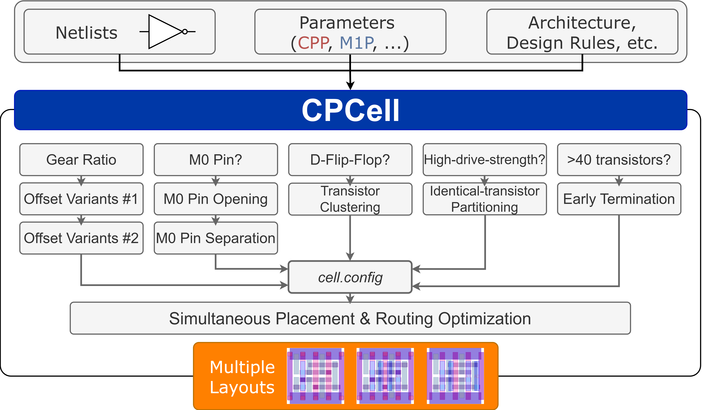

# CP-SAT based Standard Cell Layout Generator
This GitHub repo provides the Python version CP-SAT based standard cell layout generator.

The layout generation flow is shown in the below flow chart.

|  |
|:--:|

## What's New
- Added the CV32E40P core as a third block-level benchmark, alongside the AES and JPEG Encoder.
- Added the Fixed Netlist/Independent Netlist Ablation Study, which checks whether synthesizing and routing a design under different gear-ratio libraries changes the resulting PPA. See [Fixed Netlist/Independent Netlist Ablation Study](evaluation/README.md#fixed-netlistindependent-netlist-ablation-study).
- Added the 2:1 GR (gear ratio) setting to the PPA sweep. See [Power, Performance and Area Under Different Gear Ratio Settings](evaluation/README.md#power-performance-and-area-under-different-gear-ratio-settings).
- Added PPA results for the AES and CV32E40P block-level benchmarks. See [Additional Block-Level Benchmark (AES)](evaluation/README.md#additional-block-level-benchmark-aes) and [Additional Block-Level Benchmark (CV32E40P)](evaluation/README.md#additional-block-level-benchmark-cv32e40p).

# Run Guide

### System/Hardware Prerequisites

- **OS:** Linux 
- **Python:** 3.10+ (Recommended but not strictly required)
- **CPU:** ≥ 4 cores recommended for parallel solving

### 1. Install dependencies

```bash
pip install -r requirements.txt
```

Key packages: `ortools ≥ 9.14`, `klayout ≥ 0.30`, `numpy`, `networkx`, `matplotlib`, `scikit-learn`.

### 2. Run the cell generation flow

```bash
# Step 1 — Generate per-cell JSON config files
make smtcell_config

# Step 2 — Solve (simultaneous place-and-route)
make smtcell_spnr

# Step 3 — Export GDS
make smtcell_gds
```

That's it. Your layouts will appear in `output/<library>/<height>/gds/`.

### 3. Debugging tools

| Command | Purpose |
|:--|:--|
| `make viewcell` | Generate a `.png` canvas visualization with placement, routing, and net labels |
| `make check_duplicate_vars` | Detect accidental duplicate Boolean variable names in CP-SAT |
---

## Workflow Overview

```
┌──────────────┐     ┌───────────────┐     ┌──────────────┐     ┌───────────┐
│  .layer file │────▶│ smtcell_config│────▶│ smtcell_spnr │────▶│smtcell_gds│
│  (global)    │     │  (per-cell    │     │  (CP-SAT     │     │ (export)  │
│              │     │   .json)      │     │   solving)   │     │           │
└──────────────┘     └───────────────┘     └──────┬───────┘     └───────────┘
                                                  │
                                           FEASIBLE / OPTIMAL ?
                                           ├─ Yes → proceed to GDS
                                           └─ No  → disable speedups
                                                    & retry, or adjust
                                                    canvas size
```

## Configuration Reference

SMTCell uses two configuration files per run:

### Layer Configuration (`.layer`)

Defines the standard-cell canvas — applied **globally** across a technology and architecture. Each layer is either a **metal** or a **via**:

```jsonc
// Metal layer
"M1": {
  "layer_type": "metal",
  "layer_name": "M1",
  "direction": "V",        // "V" (vertical) or "H" (horizontal)
  "offset": 0.0,
  "pitch": 45.0,
  "width": 2.0,
  "info": "M1 in PROBE3"
}

// Via layer
"V0": {
  "layer_type": "via",
  "layer_name": "V0",
  "upper_layer": "M1",
  "lower_layer": "M0",
  "info": "V0 in PROBE3"
}
```

Layers must be ordered **bottom → top**, with a via between each adjacent metal pair.

### Cell Configuration (`.json`)

Generated automatically by `make smtcell_config`, then customizable per cell. Parameters fall into four groups:

<summary><strong>🔧 TECH — Technology Rules</strong></summary>

| Parameter | Type | Description |
|:--|:--:|:--|
| `minimum_gate_cut_length` | int | Min gate-cut length in #CPP. Diffusion breaks count as legal cuts. |
| `via_c2c_rule` | dict | Center-to-center via separation between layer pairs. |
| `mar_c2c_rule` | dict | Center-to-center minimum-area rule per metal layer. |
| `eol_c2c_rule` | dict | Center-to-center end-of-line rule per metal layer. |
| `insert_num_db` | int | Extra CPP columns to enlarge the canvas (helps with INFEASIBLE results). |
| `MPO` | int | Minimum pin opening at M2. Recommended: 2 for 4T. |
| `m0_pin_separation` | bool | Enforce that no two M0 pins share the same row. Reduces coupling risk between adjacent power/signal wires. Default: `false`. |
| `m0_pin_extension` | bool/int | Extend each M0 pin outward to `vacancy_edges` empty track segments. Improves routability for M0-pinned nets. Default: `true`, `vacancy_edges: 2`. |

<summary><strong>🧮 SOLVER — CP-SAT Solver Settings</strong></summary>

| Parameter | Type | Description |
|:--|:--:|:--|
| `seed` | int | Random seed for deterministic results. |
| `model_preset` | int | Solver hyperparameter preset. Default `2` (disables LP relaxation for Boolean-heavy models). |
| `num_search_workers` | int | CPU cores for parallel solving. Recommended: 4–10. |
| `use_relative_gap` | bool/float | Early stopping when optimality gap ≤ threshold. 0.5–1% for large DFFs. |

<summary><strong>🚀 SPEEDUP — Acceleration Settings</strong></summary>

| Parameter | Type | Description |
|:--|:--:|:--|
| `use_placement_order_for_identical_transistors` | bool | Pre-determine placement order for identical transistors (high-D cells). |
| `use_break_symmetry_for_placement` | bool | Break placement symmetry to prune the search space. |
| `inject_cluster` | obj | Automatic transistor clustering for large DFFs. Safe at cluster size 2; sizes 4–6 give more speedup but risk INFEASIBLE. |


---

## Project Structure

```
workdir/
├── input/
│   ├── cdl/                  # Input netlists (.cdl)
│   ├── config/               # Layer configuration files (.layer)
│   ├── pin_input_collection.json
│   └── pin_output_collection.json
├── output/<library>/<height>/
│   ├── config/               # Per-cell JSON configs
│   ├── constraint/           # Constraint logs (debug)
│   ├── gds/                  # Generated layouts
│   ├── logs/                 # Solver logs
│   ├── result/               # .res (solution) + .var (variables)
│   └── view/                 # Canvas visualizations (.png)
├── src/
│   ├── core/                 # Constraint modeling
│   ├── gds/                  # GDS generation
│   ├── solve/                # CP-SAT solver wrappers
│   ├── tech/                 # Technology database
│   ├── utility/              # Config, helpers
│   └── visual/               # Canvas visualization
├── evaluation/
│   ├── libgen/               # Library characterization (LVS/PEX, Liberty, DB, NDM)
│   └── blockeval/            # Block-level P&R and IR-drop evaluation
├── miscellaneous/            # KLayout .lyp tech files
├── Makefile
└── requirements.txt
```

## Evaluation

Post-layout evaluation scripts live under [`evaluation/`](evaluation/). The flow covers library characterization and block-level PPA / IR-drop assessment using the JPEG Encoder benchmark.

| Stage | Tool | Output |
|:--|:--|:--|
| LVS & PEX | Cadence Pegasus / Quantus | RC-extracted netlists (`.sp`) |
| Characterization | Cadence Liberate | Liberty files (`.lib`) |
| DB conversion | Synopsys Library Compiler | `.db` for ICC2 |
| Synthesis & P&R | Synopsys DC / IC Compiler II | PPA metrics |
| IR-drop | Cadence Voltus | IR-drop maps |

See [`evaluation/README.md`](evaluation/README.md) for full setup and commands.

---

# Past & Related Repository
- **Previous Work: Z3 Solver + FinFET Based**
  - SMT-based-STDCELL-Layout-Generator \[[Link](https://github.com/ckchengucsd/SMTCellUCSD)\]
  - SMT-based-STDCELL-Layout-Generator-Multi-Height \[[Link](https://github.com/ckchengucsd/SMTCellUCSD-MH)\]
- **PROBE3.0**
  - Design-Technology pathfinding framework incorporating the SMT based cell layout generator \[[Link](https://github.com/ABKGroup/PROBE3.0)\]

# Knowledge Reference
- Park, Dong Won Dissertation: [Logical Reasoning Techniques for Physical Layout in Deep Nanometer Technologies](https://escholarship.org/content/qt9mv5653s/qt9mv5653s.pdf)
- Ho, Chia-Tung Dissertation: [Novel Computer Aided Design (CAD) Methodology for Emerging Technologies to Fight the
Stagnation of Moore's Law](https://escholarship.org/content/qt2ts172zd/qt2ts172zd.pdf)
- C.-K. Cheng, C.-T. Ho, D. Lee and B. Lin, "Multi-row Complementary-FET (CFET) Standard Cell Synthesis Framework using Satisfiability Modulo Theories (SMT)", IEEE Journal of Exploratory Solid-State Computational Devices and Circuits, 2021, Open Access. \[[Paper](https://ieeexplore.ieee.org/stamp/stamp.jsp?tp=&arnumber=9390403)\]
- C.-K. Cheng, C.-T. Ho, D. Lee and D. Park, "A Routability-Driven Complimentary-FET (CFET) Standard Cell Synthesis Framework using SMT", ACM/IEEE Int. Conf. on Computer-Aided Design, pp. 1-8, 2020. \[[Paper](https://ieeexplore.ieee.org/stamp/stamp.jsp?tp=&arnumber=9256570)\]
- C.-K. Cheng, A. B. Kahng, B. Kang, S. Kang, J. Lee and B. Lin, "SO3-Cell: Standard Cell Layout Synthesis Framework for Simultaneous Optimization of Topology, Placement, and Routing", Proc. ACM/IEEE Intl. Conf. on Computer-Aided Design, 2025. \[[Paper](https://vlsicad.ucsd.edu/Publications/Conferences/418/c418.pdf)\] \[[Slides](https://view.officeapps.live.com/op/view.aspx?src=https%3A%2F%2Fvlsicad.ucsd.edu%2FPublications%2FConferences%2F418%2Fc418.pptx&wdOrigin=BROWSELINK)\]
- C.-K. Cheng, A. B. Kahng, B. Lin, Y. Wang and D. Yoon, "Gear-Ratio-Aware Standard Cell Layout Framework for DTCO Exploration", Proc. ACM/IEEE International Workshop on System-Level Interconnect Problems and Pathfinding, 2023. \[[Paper](https://vlsicad.ucsd.edu/Publications/Conferences/402/c402.pdf)\]
- D. Park, I. Kang, Y. Kim, S. Gao, B. Lin and C.-K. Cheng, "ROAD: Routability Analysis and Diagnosis Framework Based on SAT Techniques", ACM/IEEE Int. Symp. on Physical Design, pp. 65-72, 2019. \[[Paper](https://dl.acm.org/doi/pdf/10.1145/3299902.3309752)\] \[[Slides](https://cseweb.ucsd.edu//~kuan/talk/placeroute18/routability.pdf)\]
- D. Park, D. Lee, I. Kang, S. Gao, B. Lin and C.-K. Cheng, "SP&R: Simultaneous Placement and Routing Framework for Standard Cell Synthesis in Sub-7nm", IEEE Asia and South Pacific Design Automation, pp. 345-350, 2020. \[[Paper](https://ieeexplore.ieee.org/stamp/stamp.jsp?tp=&arnumber=9045729)\] 
- D. Lee, C.-T. Ho, I. Kang, S. Gao, B. Lin and C.-K. Cheng, "Many-Tier Vertical Gate-All-Around Nanowire FET Standard Cell Synthesis for Advanced Technology Nodes", IEEE Journal of Exploratory Solid-State Computational Devices and Circuits, 2021, Open Access. \[[Paper](https://ieeexplore.ieee.org/stamp/stamp.jsp?tp=&arnumber=9454552)\]
- A. B. Kahng, S. Kang, S. Kim, J. Lee and D. Yoon, "Au-MEDAL: Adaptable Grid Router with Metal Edge Detection And Layer Integration", Proc. Asia and South Pacific Design Automation Conference, 2026. \[[Paper](https://vlsicad.ucsd.edu/Publications/Conferences/420/c420.pdf)\] \[[Slides](https://view.officeapps.live.com/op/view.aspx?src=https%3A%2F%2Fvlsicad.ucsd.edu%2FPublications%2FConferences%2F420%2Fc420.pptx&wdOrigin=BROWSELINK)\]
