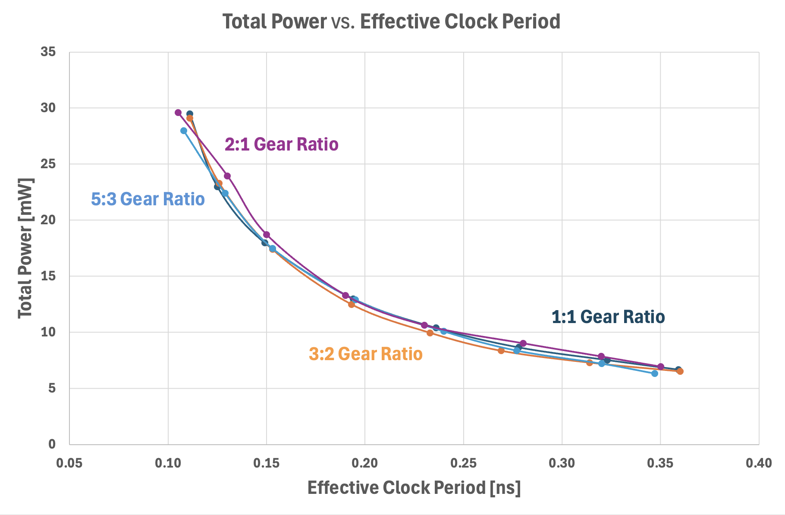
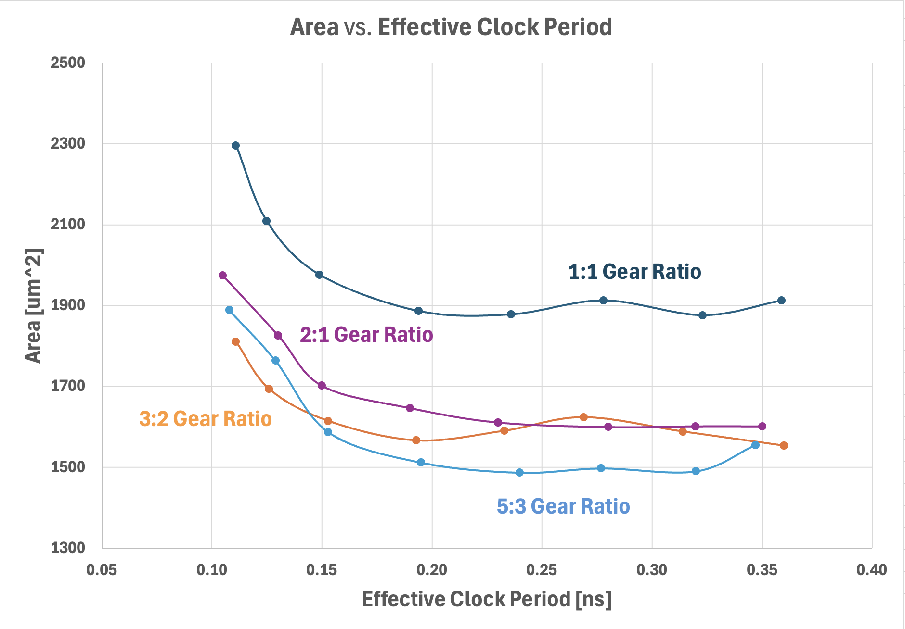

# Standard Cell Evaluation Flow for Gear-Ratio and Offset Application
This sub-repository provides the flows for standard cell characterization, place-and-route (P&R), and IR-drop evaluation.

## Directory Structure

```
evaluation/
├── libgen/                  # Library characterization directories
│   ├── 1:1GR/                 # 1:1 GR (45nm:45nm) Libraries (No offset)
│   ├── 3:2GR/                 # 3:2 GR (45nm:30nm) Libraries (No offset)
│   ├── 3:2GR_15offset/        # 3:2 GR (45nm:30nm) Libraries (15nm-offset)
│   ├── 5:3GR/                 # 5:3 GR (45nm:27nm) Libraries (No offset)
│   ├── 5:3GR_9offset/         # 5:3 GR (45nm:27nm) Libraries (9nm-offset)
│   ├── 5:3GR_18offset/        # 5:3 GR (45nm:27nm) Libraries (18nm-offset)
│   └── 2:1GR/                 # 2:1 GR (45nm:22.5nm) Libraries (No offset)
├── blockeval/               # Place-and-Route and IR-drop evaluation flows
│   ├── design/                 # Shared RTL for block-level benchmarks
│   │   ├── jpeg_encoder/         # OpenCores JPEG Encoder
│   │   └── aes_cipher_top/       # OpenCores AES
│   ├── 1:1GR/                 # 1:1 GR flows / no-offset only
│   ├── 3:2GR/                 # 3:2 GR flows / no-offset only
│   ├── 3:2GR_ECG/             # 3:2 GR flows / Equivalent Cell Group
│   ├── 5:3GR/                 # 5:3 GR flows / no-offset only
│   ├── 5:3GR_ECG/             # 5:3 GR flows / Equivalent Cell Group
│   └── 2:1GR/                 # 2:1 GR flows / no-offset only
└── results/                 # Reported PPA results (tables, generated figures)
```

## Library Characterization 

Flow scripts for library characterization are located in the *libgen* directory. Required tools are:
- **Cadence Pegasus:** LVS and PEX (v21.3)
- **Cadence Quantus:** PEX (v21.2)
- **Cadence Liberate:** Characterization (v23.1)
- **Synopsys Library Compiler:** DB file generation (L-2016.06-SP3)

```bash
# Step 0 — Signoff
# Inputs: GDS, tech file (*.tf)
# Outputs: pass/fail report
make signoff

# Step 1 — LVS and PEX
# Inputs: GDS, CDL, and cell list
# Outputs: RC-extracted spice netlists (*.sp)
make lvspex

# Step 2 — Characterization (Liberty generation)
# Inputs: RC-extracted spice netlists (*.sp), cell list, and Liberty template
# Outputs: Liberties (*.lib)
make libchar

# Step 3 — DB file generation for ICC2 place-and-route
# Inputs: Liberties (*.lib)
# Outputs: DB files (*.db)
make dbconv

# Step 4-1 — NDM generation
# Inputs: LEF files (*.lef)
# Outputs: NDM files (*.ndm)
# Run directory: libgen/{GR_option}/results/ndm/
icc2_lm_shell
source run_icc2_lm_PROBE.tcl

# Step 4-2 — NDM generation for Equivalent Cell Group (ECG)
# This is only required if you are implementing an ECG
# Inputs: LEF files (*.lef)
# Outputs: NDM files (*.ndm)
# Run directory: libgen/{GR_option}/results/ndm/
icc2_lm_shell
source run_icc2_lm_createCellGroup.tcl
```

## Block-level Evaluation 
We use a JPEG Encoder design for our block-level evaluation.

### PPA Evaluation
For PPA evaluation, you need to specify the target clock period and utilization.
- **Synopsys Design Compiler:** Synthesis (v20.09)
- **Synopsys IC Compiler II:** Place-and-Route (v20.09)

```bash
# Run directory: evaluation/{GR_option}/
# Example: Target clock period = 100ps / Target utilization: 85%
./run.sh 0.100 0.85
```
### IR-drop Evaluation
IR-drop flow scripts are located under **1:1GR**, **3:2GR*_*ECG**, and **5:3GR*_*ECG** only
- **Cadence Voltus:** IR-drop measurement (v21.1)

```bash
# Run directory: evaluation/blockeval/{GR_option}/IRdrop/
## Create links to the voltage source files
ln -s ../{target_pnr_dir}/VDD.vsrc .
ln -s ../{target_pnr_dir}/VSS.vsrc .

## Create links to the target design files
## DEF file: 
ln -s ../{target_pnr_dir}/enc_orig/fc_jpeg_encoder.def jpeg_encoder.def
## SDC file: 
ln -s ../{target_pnr_dir}/gate/fc_jpeg_encoder.def jpeg_encoder.sdc
## SPEF file: 
ln -s ../{target_pnr_dir}/enc_orig/fc_jpeg_encoder.def jpeg_encoder.spef

## Voltus run
./run.csh
```


# Results Reference

## Power, Performance and Area Under Different Gear Ratio Settings
The tables below reproduce Table IX from the paper: implementation metrics (instance
count, wirelength, power, timing, area) for the JPEG Encoder block, swept across target
clock periods from 0.10ns to 0.40ns, for each gear-ratio (GR) option evaluated.

<table>
<tr>
<td></td>
<td></td>
</tr>
</table>

These extend the paper's Fig. 19 with the 2:1 GR series added, generated from
`results/table_ix_ppa.csv`.

### 1:1 GR

| Metric | 0.10 | 0.12 | 0.15 | 0.20 | 0.25 | 0.30 | 0.35 | 0.40 |
|---|---:|---:|---:|---:|---:|---:|---:|---:|
| #Insts | 59472 | 46995 | 44790 | 43672 | 43215 | 43045 | 42815 | 42685 |
| Wirelength (μm) | 91637 | 83180 | 81885 | 72199 | 69993 | 66639 | 65531 | 65480 |
| Total Power (mW) | 29.5 | 23.0 | 18.0 | 13.0 | 10.4 | 8.7 | 7.5 | 6.7 |
| Worst Negative Slack (ns) | -0.011 | -0.005 | 0.001 | 0.006 | 0.014 | 0.022 | 0.027 | 0.041 |
| Effective CLKP (ns) | 0.111 | 0.125 | 0.149 | 0.194 | 0.236 | 0.278 | 0.323 | 0.359 |
| Area (μm²) | 2296 | 2108 | 1976 | 1886 | 1878 | 1912 | 1876 | 1912 |

### 3:2 GR — 0-offset Only

| Metric | 0.10 | 0.12 | 0.15 | 0.20 | 0.25 | 0.30 | 0.35 | 0.40 |
|---|---:|---:|---:|---:|---:|---:|---:|---:|
| #Insts | 57919 | 54403 | 52951 | 47918 | 46307 | 45677 | 45319 | 45253 |
| Wirelength (μm) | 73759 | 71986 | 71602 | 72681 | 65940 | 63185 | 63707 | 62488 |
| Total Power (mW) | 28.4 | 23.3 | 18.4 | 13.7 | 10.8 | 9.0 | 7.7 | 6.8 |
| Worst Negative Slack (ns) | -0.008 | -0.004 | -0.001 | 0.001 | 0.004 | 0.014 | 0.019 | 0.030 |
| Effective CLKP (ns) | 0.108 | 0.124 | 0.151 | 0.199 | 0.246 | 0.286 | 0.331 | 0.370 |
| Area (μm²) | 1898 | 1826 | 1777 | 1726 | 1680 | 1703 | 1659 | 1690 |

### 3:2 GR — Mixed-offset

| Metric | 0.10 | 0.12 | 0.15 | 0.20 | 0.25 | 0.30 | 0.35 | 0.40 |
|---|---:|---:|---:|---:|---:|---:|---:|---:|
| #Insts | 57429 | 44080 | 42490 | 41543 | 41216 | 41144 | 41112 | 41087 |
| Wirelength (μm) | 73338 | 77240 | 65216 | 59613 | 55371 | 54463 | 56735 | 55264 |
| Total Power (mW) | 29.1 | 23.3 | 17.4 | 12.5 | 10.0 | 8.4 | 7.3 | 6.5 |
| Worst Negative Slack (ns) | -0.011 | -0.006 | -0.003 | 0.007 | 0.017 | 0.031 | 0.036 | 0.040 |
| Effective CLKP (ns) | 0.111 | 0.126 | 0.153 | 0.193 | 0.233 | 0.269 | 0.314 | 0.360 |
| Area (μm²) | 1810 | 1694 | 1614 | 1566 | 1590 | 1624 | 1588 | 1553 |

### 5:3 GR — 0-offset Only

| Metric | 0.10 | 0.12 | 0.15 | 0.20 | 0.25 | 0.30 | 0.35 | 0.40 |
|---|---:|---:|---:|---:|---:|---:|---:|---:|
| #Insts | 59541 | 57871 | 52984 | 47065 | 54111 | 53054 | 52554 | 52623 |
| Wirelength (μm) | 77526 | 81707 | 69595 | 73821 | 72639 | 69966 | 69677 | 68174 |
| Total Power (mW) | 27.2 | 23.3 | 17.5 | 13.3 | 10.8 | 9.1 | 7.8 | 6.9 |
| Worst Negative Slack (ns) | -0.004 | -0.004 | 0.001 | 0.002 | 0.008 | 0.014 | 0.023 | 0.033 |
| Effective CLKP (ns) | 0.104 | 0.124 | 0.149 | 0.198 | 0.242 | 0.286 | 0.327 | 0.367 |
| Area (μm²) | 1962 | 1836 | 1742 | 1726 | 1802 | 1816 | 1789 | 1802 |

### 5:3 GR — Mixed-offset

| Metric | 0.10 | 0.12 | 0.15 | 0.20 | 0.25 | 0.30 | 0.35 | 0.40 |
|---|---:|---:|---:|---:|---:|---:|---:|---:|
| #Insts | 54311 | 50951 | 41213 | 39900 | 39594 | 38980 | 38808 | 38752 |
| Wirelength (μm) | 72570 | 69274 | 71586 | 66768 | 63838 | 56642 | 54316 | 55189 |
| Total Power (mW) | 28.0 | 22.4 | 17.5 | 12.9 | 10.1 | 8.4 | 7.2 | 6.3 |
| Worst Negative Slack (ns) | -0.008 | -0.009 | -0.003 | 0.005 | 0.010 | 0.023 | 0.030 | 0.053 |
| Effective CLKP (ns) | 0.108 | 0.129 | 0.153 | 0.195 | 0.240 | 0.277 | 0.320 | 0.347 |
| Area (μm²) | 1888 | 1763 | 1586 | 1511 | 1486 | 1497 | 1490 | 1555 |

### 2:1 GR

| Metric | 0.10 | 0.12 | 0.15 | 0.20 | 0.25 | 0.30 | 0.35 | 0.40 |
|---|---:|---:|---:|---:|---:|---:|---:|---:|
| #Insts | 59293 | 48769 | 46457 | 44845 | 43987 | 43709 | 43511 | 43331 |
| Wirelength (μm) | 85761 | 80389 | 81638 | 70843 | 72998 | 76912 | 72098 | 69774 |
| Total Power (mW) | 29.6 | 24.0 | 18.7 | 13.3 | 10.6 | 9.0 | 7.9 | 6.9 |
| Worst Negative Slack (ns) | -0.005 | -0.010 | 0.000 | 0.010 | 0.020 | 0.020 | 0.030 | 0.050 |
| Effective CLKP (ns) | 0.105 | 0.130 | 0.150 | 0.190 | 0.230 | 0.280 | 0.320 | 0.350 |
| Area (μm²) | 1974 | 1826 | 1701 | 1646 | 1610 | 1599 | 1601 | 1601 |

## Fixed Netlist/Independent Netlist Ablation Study
A **fixed netlist** is synthesized once under one GR library, then reused for
place-and-route under a *different* GR library.

An **independent netlist** is
synthesized under the same GR library it is placed and routed with, so each GR
library gets its own, separately-synthesized netlist. 

The purpose of this study is to isolate whether a
synthesis/P&R library mismatch changes the resulting PPA, independent of which
library the netlist happens to be routed under.

(Note: Every 3:2 entry below uses the 0-offset-only library variant.)

For each pair of rows that shares a synthesis library and TCP (so the two
rows use the same synthesized netlist), the **bold** value marks the better
PnR library choice on that metric.

<table>
<tr>
  <th>TCP (ns)</th>
  <th>Synthesis Library</th>
  <th>PnR Library</th>
  <th>#Insts (Post-Synthesis)</th>
  <th>Wirelength (μm)</th>
  <th>Total Power (mW)</th>
  <th>Worst Negative Slack (ns)</th>
  <th>Effective CLKP (ns)</th>
  <th>Area (μm²)</th>
</tr>
<tr>
  <td rowspan="4" align="center">0.1</td>
  <td rowspan="2" align="center">1:1</td>
  <td align="center">1:1</td>
  <td>28619</td><td>91637</td><td><strong>29.5</strong></td><td>-0.011</td><td>0.111</td><td>2296</td>
</tr>
<tr>
  <td align="center">3:2</td>
  <td>28619</td><td><strong>84058</strong></td><td>29.8</td><td><strong>-0.010</strong></td><td><strong>0.110</strong></td><td><strong>1951</strong></td>
</tr>
<tr>
  <td rowspan="2" align="center">3:2</td>
  <td align="center">1:1</td>
  <td>14756</td><td>82550</td><td><strong>28</strong></td><td><strong>0</strong></td><td><strong>0.100</strong></td><td>2214</td>
</tr>
<tr>
  <td align="center">3:2</td>
  <td>14756</td><td><strong>73759</strong></td><td>28.4</td><td>-0.008</td><td>0.108</td><td><strong>1898</strong></td>
</tr>
<tr>
  <td rowspan="4" align="center">0.25</td>
  <td rowspan="2" align="center">1:1</td>
  <td align="center">1:1</td>
  <td>17757</td><td>69993</td><td><strong>10.4</strong></td><td><strong>0.014</strong></td><td><strong>0.236</strong></td><td>1878</td>
</tr>
<tr>
  <td align="center">3:2</td>
  <td>17757</td><td><strong>64920</strong></td><td>10.5</td><td>0.010</td><td>0.240</td><td><strong>1624</strong></td>
</tr>
<tr>
  <td rowspan="2" align="center">3:2</td>
  <td align="center">1:1</td>
  <td>11106</td><td>106199</td><td>11.9</td><td>-0.170</td><td>0.420</td><td>1886</td>
</tr>
<tr>
  <td align="center">3:2</td>
  <td>11106</td><td><strong>65940</strong></td><td><strong>10.8</strong></td><td><strong>0.004</strong></td><td><strong>0.246</strong></td><td><strong>1680</strong></td>
</tr>
<tr>
  <td rowspan="4" align="center">0.4</td>
  <td rowspan="2" align="center">1:1</td>
  <td align="center">1:1</td>
  <td>18794</td><td>65480</td><td><strong>6.7</strong></td><td>0.041</td><td>0.359</td><td>1912</td>
</tr>
<tr>
  <td align="center">3:2</td>
  <td>18794</td><td><strong>59755</strong></td><td>6.8</td><td><strong>0.060</strong></td><td><strong>0.340</strong></td><td><strong>1656</strong></td>
</tr>
<tr>
  <td rowspan="2" align="center">3:2</td>
  <td align="center">1:1</td>
  <td>11260</td><td>73969</td><td>7.09</td><td><strong>0.050</strong></td><td><strong>0.350</strong></td><td>1890</td>
</tr>
<tr>
  <td align="center">3:2</td>
  <td>11260</td><td><strong>62488</strong></td><td><strong>6.8</strong></td><td>0.030</td><td>0.370</td><td><strong>1690</strong></td>
</tr>
</table>

## Additional Block-Level Benchmark (AES)
The Advanced Encryption Standard (AES) is also available as a block-level
benchmark, alongside the JPEG Encoder used above.

### 1:1 GR

| Metric | 0.10 | 0.12 | 0.15 | 0.20 | 0.25 | 0.30 | 0.35 | 0.40 |
|---|---:|---:|---:|---:|---:|---:|---:|---:|
| #Insts | 11403 | 11036 | 10698 | 10200 | 10194 | 10199 | 10185 | 10184 |
| Wirelength (μm) | 30514 | 29937 | 29225 | 27459 | 27463 | 27599 | 27587 | 27774 |
| Total Power (mW) | 8.6 | 6.8 | 5.1 | 3.6 | 2.9 | 2.4 | 2.1 | 1.9 |
| Worst Negative Slack (ns) | -0.039 | -0.026 | -0.003 | 0.006 | 0.041 | 0.084 | 0.138 | 0.188 |
| Effective CLKP (ns) | 0.139 | 0.146 | 0.153 | 0.194 | 0.209 | 0.217 | 0.212 | 0.213 |
| Area (μm²) | 428 | 417 | 399 | 377 | 377 | 377 | 377 | 375 |

### 3:2 GR — 0-offset Only

| Metric | 0.10 | 0.12 | 0.15 | 0.20 | 0.25 | 0.30 | 0.35 | 0.40 |
|---|---:|---:|---:|---:|---:|---:|---:|---:|
| #Insts | 11833 | 11531 | 11149 | 10580 | 10565 | 10553 | 10561 | 10559 |
| Wirelength (μm) | 29071 | 27217 | 26239 | 24702 | 24626 | 24429 | 24715 | 24488 |
| Total Power (mW) | 8.2 | 6.6 | 5.0 | 3.6 | 2.8 | 2.4 | 2.1 | 1.8 |
| Worst Negative Slack (ns) | -0.070 | -0.023 | -0.003 | 0.003 | 0.031 | 0.091 | 0.135 | 0.183 |
| Effective CLKP (ns) | 0.170 | 0.143 | 0.153 | 0.198 | 0.220 | 0.209 | 0.216 | 0.217 |
| Area (μm²) | 371 | 366 | 343 | 311 | 313 | 313 | 313 | 313 |

### 3:2 GR — Mixed-offset

| Metric | 0.10 | 0.12 | 0.15 | 0.20 | 0.25 | 0.30 | 0.35 | 0.40 |
|---|---:|---:|---:|---:|---:|---:|---:|---:|
| #Insts | 11590 | 11507 | 11095 | 10576 | 10562 | 10578 | 10578 | 10557 |
| Wirelength (μm) | 27825 | 27130 | 26810 | 24930 | 25051 | 24656 | 25092 | 24661 |
| Total Power (mW) | 8.3 | 6.7 | 5.1 | 3.6 | 2.9 | 2.4 | 2.1 | 1.9 |
| Worst Negative Slack (ns) | -0.049 | -0.029 | -0.012 | 0.002 | 0.028 | 0.087 | 0.132 | 0.183 |
| Effective CLKP (ns) | 0.149 | 0.149 | 0.162 | 0.198 | 0.222 | 0.213 | 0.219 | 0.217 |
| Area (μm²) | 370 | 366 | 343 | 317 | 317 | 321 | 317 | 317 |

## Additional Block-Level Benchmark (CV32E40P)
CV32E40P is also available as a block-level
benchmark, alongside the AES and JPEG Encoder used above.

### 1:1 GR

| Metric | 0.10 | 0.12 | 0.15 | 0.20 | 0.25 | 0.30 | 0.35 | 0.40 |
|---|---:|---:|---:|---:|---:|---:|---:|---:|
| #Insts | 44559 | 46561 | 47333 | 42784 | 38947 | 35246 | 32077 | 31584 |
| Wirelength (μm) | 123513 | 127678 | 133711 | 118789 | 111089 | 103743 | 100399 | 99035 |
| Total Power (mW) | 14.3 | 12.5 | 10.0 | 7.0 | 5.5 | 4.3 | 3.7 | 3.3 |
| Worst Negative Slack (ns) | -0.240 | -0.166 | -0.180 | -0.102 | -0.064 | -0.049 | -0.045 | -0.033 |
| Effective CLKP (ns) | 0.340 | 0.286 | 0.330 | 0.302 | 0.314 | 0.349 | 0.395 | 0.433 |
| Area (μm²) | 1648 | 1718 | 1740 | 1612 | 1499 | 1431 | 1377 | 1316 |

### 3:2 GR — 0-offset Only

| Metric | 0.10 | 0.12 | 0.15 | 0.20 | 0.25 | 0.30 | 0.35 | 0.40 |
|---|---:|---:|---:|---:|---:|---:|---:|---:|
| #Insts | 45069 | 45435 | 48003 | 42391 | 38415 | 35783 | 32749 | 31917 |
| Wirelength (μm) | 112159 | 117463 | 121595 | 106806 | 97637 | 93494 | 91013 | 88701 |
| Total Power (mW) | 14.1 | 12.6 | 9.9 | 6.8 | 5.3 | 4.3 | 3.7 | 3.2 |
| Worst Negative Slack (ns) | -0.204 | -0.170 | -0.175 | -0.086 | -0.057 | -0.062 | -0.062 | -0.022 |
| Effective CLKP (ns) | 0.304 | 0.290 | 0.325 | 0.286 | 0.307 | 0.362 | 0.412 | 0.422 |
| Area (μm²) | 1495 | 1474 | 1544 | 1386 | 1304 | 1231 | 1191 | 1151 |

### 3:2 GR — Mixed-offset

| Metric | 0.10 | 0.12 | 0.15 | 0.20 | 0.25 | 0.30 | 0.35 | 0.40 |
|---|---:|---:|---:|---:|---:|---:|---:|---:|
| #Insts | 42214 | 41858 | 42287 | 39162 | 36725 | 34967 | 31821 | 30956 |
| Wirelength (μm) | 107432 | 108416 | 107855 | 101144 | 95881 | 93596 | 91436 | 90185 |
| Total Power (mW) | 14.0 | 12.2 | 9.5 | 7.1 | 5.3 | 4.5 | 3.8 | 3.2 |
| Worst Negative Slack (ns) | -0.217 | -0.193 | -0.145 | -0.111 | -0.090 | -0.091 | -0.119 | -0.072 |
| Effective CLKP (ns) | 0.317 | 0.313 | 0.295 | 0.311 | 0.340 | 0.391 | 0.469 | 0.472 |
| Area (μm²) | 1376 | 1357 | 1369 | 1291 | 1231 | 1202 | 1151 | 1140 |

# Knowledge Reference
- OpenCores JPEG Encoder. \[[Link](https://opencores.org/projects/mkjpeg)\]
- OpenCores AES. \[[Link](https://opencores.org/projects/aes_core)\]
- CORE-V CV32E40P. \[[Link](https://docs.openhwgroup.org/projects/cv32e40p-user-manual/en/cv32e40p_v1.2.1/)\]
- Cadence Pegasus, Quantus and Voltus. \[[Link](https://cadence.com)\]
- Synopsys Design Compiler, IC Compiler II. \[[Link](https://synopsys.com)\]
